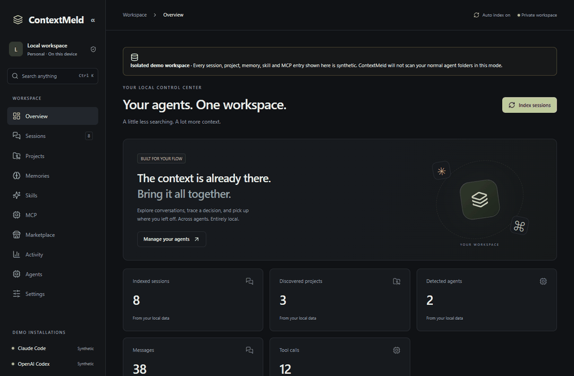
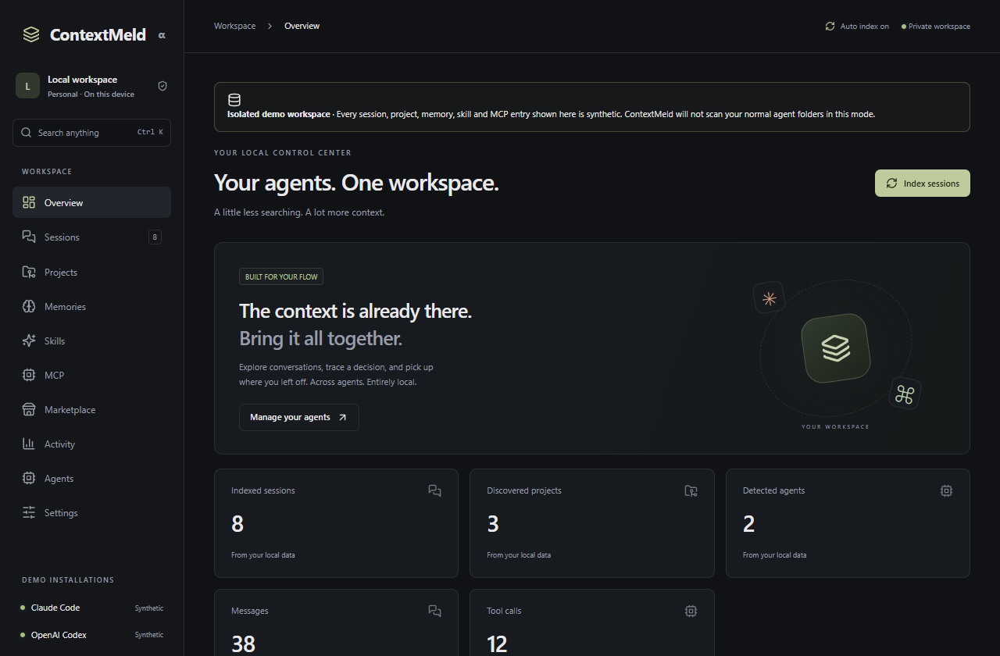
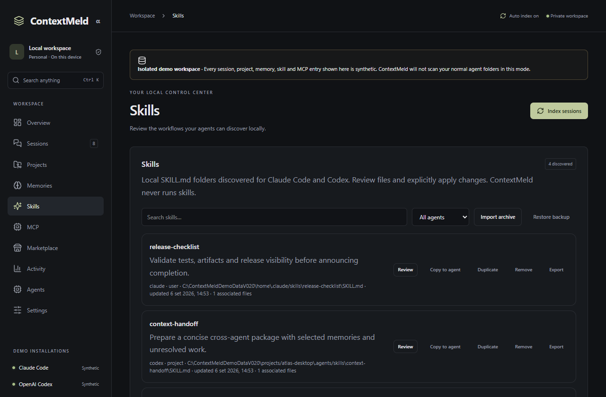
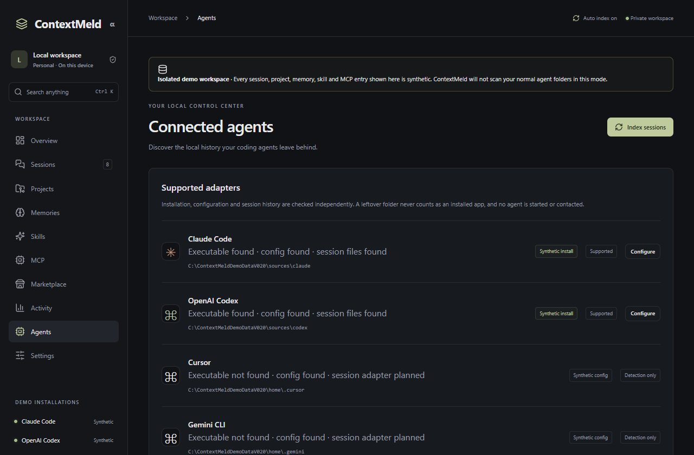
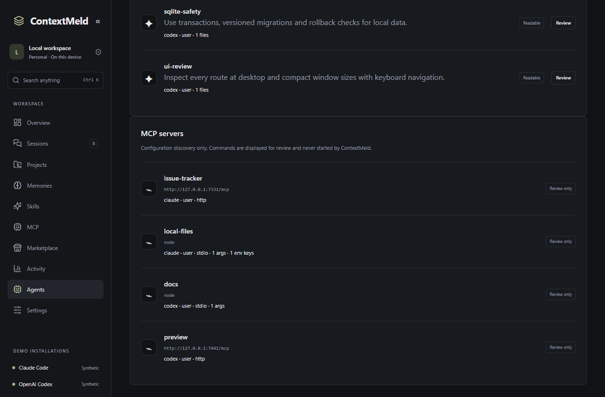
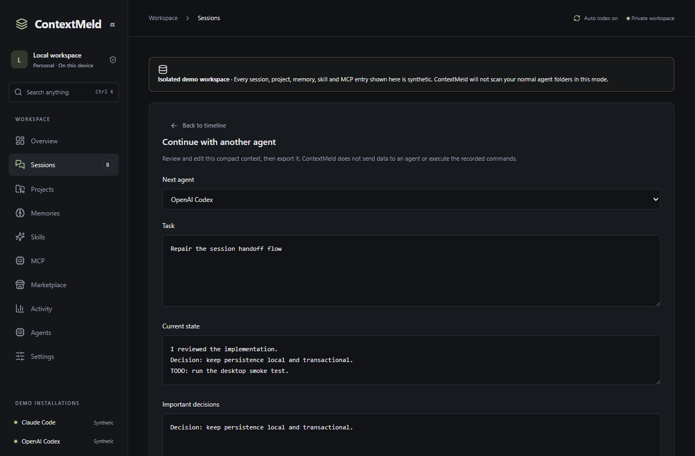

# ContextMeld

**The local control center for all your AI coding agents.**

Claude Code · OpenAI Codex · More adapters coming

[Download ContextMeld v0.2.0](https://github.com/Ste2027/ContextMeld/releases/tag/v0.2.0) · MIT · Tauri + Rust + React · No telemetry



ContextMeld indexes the coding-agent history already on your machine. Browse sessions, search across projects, preserve useful memories, review skills and MCP configuration, then carry a compact context package from Claude Code to Codex or back again.

| Unified Sessions                         | Universal Search                                                         | Cross-Agent Context                        | Skills                                           | MCP                                            | Local-first Privacy                    |
| ---------------------------------------- | ------------------------------------------------------------------------ | ------------------------------------------ | ------------------------------------------------ | ---------------------------------------------- | -------------------------------------- |
| Claude and Codex history in one timeline | Sessions, messages, commands, errors, projects, memories, skills and MCP | Editable Markdown or JSON handoff packages | Discover, review, edit, copy, import and restore | Inspect and safely change JSON or TOML servers | Local SQLite, no account, no telemetry |

## Quick install

Download the installer for your platform from the [latest release](https://github.com/Ste2027/ContextMeld/releases/latest):

- **Windows:** NSIS setup or MSI (`x64`)
- **macOS:** DMG (architecture shown in the release asset)
- **Linux:** AppImage, DEB or RPM (`x86_64`)

Release packages are currently unsigned. Your operating system may show its standard warning for an unidentified developer.

To build from source:

```sh
npm ci
npm run desktop
```

Node.js 24, Rust 1.94 or newer, and the [Tauri platform prerequisites](https://v2.tauri.app/start/prerequisites/) are required.

## Why ContextMeld

Useful work gets split across tools. You remember solving a problem, but not which agent, project or conversation contains the decision. ContextMeld reads supported local files into one searchable workspace and never starts an agent, executes a transcript command, or uploads your history.



## Demo

Start an isolated, fully synthetic workspace without scanning normal agent folders:

```powershell
$env:CONTEXTMELD_DEMO="1"
npm run desktop
```

The demo contains sessions, projects, tool calls, an error, memories, skills, MCP servers and a Claude-to-Codex handoff. Demo mode is clearly labelled in the UI.



## Features

- **Dashboard and activity:** real counts for indexed sessions, projects, events, tool calls, models and recorded errors.
- **Sessions:** filters for agent, project, model and date; pagination; direct opening; paginated timelines for large sessions.
- **Timeline:** messages, tool calls, terminal commands, tool results, file requests and recorded errors remain inert text.
- **Universal Search:** press `Ctrl/Cmd + K` to search local indexed content and open the matching session event, project, memory, skill or MCP server.
- **Projects:** recorded path, local Git state, branch, agents, session count, memories, skills, errors, recent work and referenced files.
- **Memories:** create, edit, duplicate, search, filter, trash, restore, import, export, export all and explicitly add selected memories to a handoff.
- **Skills:** recursively discover and inspect complete packages; edit `SKILL.md`; duplicate, copy, remove, restore, import and export with conflict and stale-file checks.
- **Marketplace:** opt-in browsing of public GitHub repositories with a bounded file tree, scripts/MCP warnings, exact destination preview and atomic install. Remote scripts are never run.
- **MCP:** discover individual Claude JSON and Codex TOML servers; mask secrets; add, inspect, edit, duplicate, enable/disable, remove, copy, validate and roll back.
- **Cross-agent context:** preview and edit task, state, decisions, TODOs, files, commands, errors, selected memories, relevant skills, repository and bounded Git diff; copy or export Markdown/JSON.
- **Automatic indexing:** a native file watcher follows supported local Claude and Codex session folders and indexes changed JSONL files after a short debounce.
- **Settings:** automatic defaults plus portable path overrides, watcher controls, isolated storage, dark/light themes and manual reindexing.

## Supported agents

Detection checks the executable, configuration directory and session directory independently. Only an executable found on the machine counts as an installed agent in the sidebar. Old history or a leftover configuration folder is labelled separately.

| Agent          | Installation detection   | Sessions                | Skills    | MCP                  | Current status |
| -------------- | ------------------------ | ----------------------- | --------- | -------------------- | -------------- |
| Claude Code    | Executable + local paths | Supported JSONL         | Supported | Full JSON management | Supported      |
| OpenAI Codex   | Executable + local paths | Supported rollout JSONL | Supported | Full TOML management | Supported      |
| Cursor         | Executable + config      | Planned                 | Planned   | Planned              | Detection only |
| Gemini CLI     | Executable + config      | Planned                 | Planned   | Planned              | Detection only |
| OpenCode       | Executable + config      | Planned                 | Planned   | Planned              | Detection only |
| GitHub Copilot | Executable + config      | Planned                 | Planned   | Planned              | Detection only |

ContextMeld never invents an adapter when a stable, testable local format is unavailable. See [adapter assumptions and fixtures](docs/adapters.md).





## Cross-agent handoff

Open a session and choose **Continue with another agent**. ContextMeld derives a compact package rather than dumping the whole conversation. Edit every field, choose memories explicitly, inspect the Git context, then copy or export it.



## Privacy

- No telemetry, account, cloud backend, AI API call, remote font or automatic upload.
- Original transcripts are opened read-only and never modified.
- ContextMeld writes only after an explicit user action. Skill and MCP mutations use backups, expected hashes, atomic replacement, parse validation and rollback.
- MCP secret values are masked in normal views. The explicit editor reveals local values only while it is open.
- Marketplace access happens only after **Browse** or **Inspect** and is limited to public GitHub API/raw content.
- Commands, scripts and tool calls are displayed as text and are never executed.

The SQLite index is not encrypted and may contain private transcript text. Protect the application data directory with your operating-system account and disk encryption. The exact database path appears under **Settings → Local storage**.

## Installation and storage

On first launch, finish onboarding and choose **Index my sessions**. ContextMeld uses the supported agents' standard per-user directories. Path overrides are optional and global: no developer-specific path is compiled into the app. After the initial index, the native watcher keeps supported session files current automatically. You can disable it or run a full manual index at any time.

For portable or isolated storage, set `CONTEXTMELD_DATA_DIR` to an absolute local directory before launch. The legacy `AGENTHUB_DATA_DIR` variable remains accepted for v0.1.x upgrades. ContextMeld retains the existing `agenthub.db` filename and Tauri application identifier so an upgrade finds the user's previous local index. To reset the index, close ContextMeld and remove that database plus adjacent `-wal`/`-shm` files. Source transcripts remain untouched.

`npm run dev` provides a browser-only preview. Local indexing, file review and mutations require the Tauri desktop app.

## Architecture

```text
React views → typed Tauri IPC → Rust services → SQLite + FTS5
                                      ↑
                         Claude / Codex adapters
                                      ↑
                           local JSONL transcripts
```

The Rust core parses bounded input and runs database work off the UI thread. Provider adapters normalize stable source records into sessions and ordered events. Memories live in versioned SQLite tables; skills and MCP configuration remain file-backed. See [architecture](docs/architecture.md).

## Adapter guide

A new session adapter needs an authoritative format reference, bounded traversal, synthetic normal/corrupt fixtures and an explicit capability status. Start with [docs/adapters.md](docs/adapters.md) and [CONTRIBUTING.md](CONTRIBUTING.md). Do not submit real transcripts.

## Security

Paths are restricted to absolute local filesystem locations. Directory traversal, symlink traversal, malformed JSON/JSONL/TOML, oversized input, stale writes, suspicious marketplace files and invalid post-write configuration have regression coverage. Read [SECURITY.md](SECURITY.md) before reporting a vulnerability.

## Roadmap

- Broaden verified Claude and Codex record coverage.
- Add stable session adapters for more agents when their local formats can be tested.
- Improve native integration coverage on macOS and Linux.
- Add optional encrypted local archives without changing the no-cloud default.
- Publish a community adapter SDK after the normalization contract stabilizes.

## Contributing

Read [CONTRIBUTING.md](CONTRIBUTING.md), [CODE_OF_CONDUCT.md](CODE_OF_CONDUCT.md) and [SECURITY.md](SECURITY.md). Run `npm run check`, Rust tests, rustfmt and Clippy before opening a pull request.

## FAQ

**Does ContextMeld send my history to Claude, OpenAI or another provider?**

No. A context package leaves the app only when you explicitly copy or export it and then decide where to paste or save it.

**Are Memories only reminders?**

They are reusable local context: architecture decisions, conventions, constraints and preferences. They stay in ContextMeld's local database until you explicitly select them for Context Export.

**Why can an agent show “config found” but not “installed”?**

Configuration and old session folders can survive an uninstall. The sidebar counts only a detected executable as installed.

**Does Marketplace execute a downloaded script?**

No. It lists executable-looking files as warnings and stores reviewed text only after confirmation.

**Can ContextMeld continue a session automatically?**

It prepares a compact handoff package. It does not launch agents or submit prompts.

## Known limitations

- A changed session file is reparsed as a unit. If an operating system or unusual filesystem misses an event, the manual index remains available.
- Search is literal local full-text search, not semantic search.
- Cursor, Gemini CLI, OpenCode and GitHub Copilot have installation/config detection only.
- The local index and exported context files are not encrypted.
- Release packages are unsigned; macOS and Linux artifacts are CI-built and are not run-tested on this Windows development host.
- Provider file formats can change; unsupported records are skipped and reported rather than guessed.

More screenshots are available in [docs/screenshots](docs/screenshots), and the latest verification record is in [docs/verification.md](docs/verification.md).

## License

[MIT](LICENSE). Independent community software; not affiliated with the supported agent vendors.
