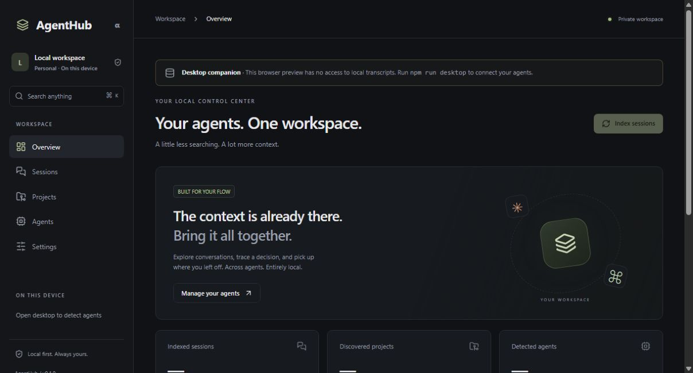

# AgentHub

**The local control center for all your AI coding agents.**

Codex. Claude Code. One place to find the work you already did.

Your coding agents store conversations, tool calls and project context in different directories. AgentHub brings that history into a private desktop workspace: browse sessions, inspect a command, find a decision, and follow a project across agents.

**MVP / alpha · MIT · Tauri + Rust + React · No telemetry**



## Why AgentHub?

You remember solving the problem. You do not remember which agent, project or conversation it was in. AgentHub gives your existing local transcripts a searchable home, without uploading them or running another model.

## Features

| Capability       | What works in this release                                                                                |
| ---------------- | --------------------------------------------------------------------------------------------------------- |
| Session browser  | Claude Code and Codex JSONL imports; filter by agent and project; newest first; pagination                |
| Timeline         | User/assistant messages, tool arguments, command text, outputs and recorded errors                        |
| Universal search | Ctrl/Cmd + K; full-text search over session titles, project paths and timeline content                    |
| Projects         | Discovered from transcript working directories, with session counts and local Git detection               |
| Indexing         | Manual incremental scans, unchanged-file skipping, per-file transactions, progress and import diagnostics |
| Agent paths      | Automatic directory detection and persistent absolute-path overrides                                      |
| Appearance       | Dark by default; optional light theme; keyboard-accessible search dialog                                  |
| Privacy          | Read-only source access; a local SQLite index; no account, telemetry or inference API                     |

Memories, skills and MCP management are part of the product roadmap. They are **not implemented** in this MVP. There are no simulated charts, fabricated success rates or fake controls for those features.

## Supported agents

| Agent          | Status                         | Default session directory                             |
| -------------- | ------------------------------ | ----------------------------------------------------- |
| Claude Code    | JSONL adapter                  | `~/.claude/projects`                                  |
| OpenAI Codex   | Rollout JSONL adapter          | `$CODEX_HOME/sessions`, otherwise `~/.codex/sessions` |
| Cursor         | Reserved provider, unsupported | —                                                     |
| Gemini CLI     | Reserved provider, unsupported | —                                                     |
| OpenCode       | Reserved provider, unsupported | —                                                     |
| GitHub Copilot | Reserved provider, unsupported | —                                                     |

“Detected” means the session directory exists. AgentHub does not connect to, launch, or authenticate with an agent. Provider formats are version-dependent; see [adapter support and assumptions](docs/adapters.md).

## Installation

Build from source. This repository does not claim a published, signed installer.

Requirements:

- Node.js 24 and npm.
- Rust stable **1.94 or newer** and Cargo on PATH.
- The [Tauri platform prerequisites](https://v2.tauri.app/start/prerequisites/). On Windows, install the C++ Build Tools workload and WebView2. macOS requires Xcode command-line tools; Linux requires its WebKitGTK development packages.

From the repository directory:

```sh
npm ci
npm run desktop
```

On first launch:

1. Open **Agents** to inspect detected directories.
2. If necessary, set absolute paths in **Settings**. Point Claude Code at `projects` and Codex at `sessions`, not their configuration files.
3. Choose **Index sessions**. Source files remain untouched.
4. Browse **Sessions** or **Projects**, or use **Ctrl/Cmd + K** to search.

`npm run dev` starts an honest browser-only UI preview at `http://127.0.0.1:1420`. Local data operations require the desktop runtime. A browser preview is not a substitute for the desktop application.

### Build

```sh
npm run desktop:build
```

Tauri writes the executable and platform bundles under `src-tauri/target/release`. Windows bundles are unsigned until a release maintainer configures signing. To build an embedded-assets development executable without an installer:

```sh
npm run desktop:build -- --debug --no-bundle
```

## Architecture

```text
React views → typed IPC client → Tauri commands
                                  ↓
                         Rust services + SQLite
                                  ↑
                     Claude / Codex adapters
                                  ↑
                      Local JSONL transcripts
```

```text
src/
  components/      Shared UI and shadcn-style primitives
  features/        Workspace pages, timeline, search, settings
  lib/             Typed IPC boundary and view models
  test/            Frontend behavior tests
src-tauri/
  src/adapters/    Provider registry and isolated parsers
  src/database.rs Transactions, migrations, queries and FTS5
  src/indexer.rs  Bounded file discovery and incremental import
  src/desktop.rs Tauri boundary and background work
  migrations/    Versioned schema
  tests/         Synthetic parser, storage and indexing tests
docs/            Design decisions and support limits
```

The Rust core builds without Tauri, so parsing and database tests need no GUI. Blocking work runs outside the UI thread. The current MVP serializes database operations with a mutex; large scans can delay queries while progress events continue.

The schema stores a session once and its ordered events once. Messages, commands and tool results share that event model instead of duplicating transcript text across multiple domain tables. A disposable FTS index supplies search. New domain tables for memories, skills and MCP will be added through migrations when those features ship.

See [architecture details](docs/architecture.md).

## Privacy

- No telemetry libraries, cloud backend, accounts, AI API calls or remote fonts.
- Transcript commands and HTML are inert text. They are never executed or rendered as active markup.
- Agent files are opened read-only. AgentHub only writes its own SQLite database.
- The production webview has a restrictive content security policy and no shell/HTTP/filesystem plugins.
- Source transcripts and the index can contain secrets. The index is **not encrypted**. Use OS account isolation and disk encryption.
- Source deletion does not delete archived sessions from the index. Changing a configured directory does not remove old imports.

The exact database path appears in **Settings → Local storage**. The default is Tauri's application-local-data directory for `dev.agenthub.desktop`, with the filename `agenthub.db`.

For portable or isolated test storage, set `AGENTHUB_DATA_DIR` to an absolute directory before starting the app. To reset an index, close AgentHub, then remove its `agenthub.db` and any adjacent `agenthub.db-wal` / `agenthub.db-shm`. This removes only the local archive and preferences; original transcripts are unaffected.

## Verification

```sh
npm run check
cargo test --manifest-path src-tauri/Cargo.toml --locked
cargo fmt --manifest-path src-tauri/Cargo.toml --check
cargo clippy --manifest-path src-tauri/Cargo.toml --all-targets --features desktop --locked -- -D warnings
```

The GitHub Actions workflow runs these checks and a Windows desktop build. No private transcripts are included in tests or screenshots. See [local verification record](docs/verification.md) for what was actually run during development.

## Current limits

- Indexing is manual; changed files are fully reparsed. Metadata fingerprints track file size and nanosecond modification time. Use **Rebuild index** when a tool preserves both while rewriting content.
- Import limit: 128 MiB per file, 8 MiB per line, directory depth 20; symbolic links are not followed. Malformed/oversized lines are counted, and failed files are reported.
- Unsupported record types, media, encrypted reasoning, token analytics and provider-specific UI events are not interpreted.
- Search uses literal token matching, not semantic search; up to 80 hits are returned. Multiple words must occur in the same indexed event (or session metadata row). It does not search future memory/skill/MCP features.
- Project discovery uses recorded paths and checks for `.git`; it does not crawl arbitrary repositories or infer frameworks.
- Windows UNC/device paths are not probed or accepted as agent directories. Project paths remain visible as transcript data even when local Git detection is unavailable.
- Session identity includes provider and source path. Copies moved to another source path appear as separate archived sessions.
- Windows is the development target verified here. macOS/Linux packaging and signing still require platform validation.

## Roadmap

- **Phase 1:** harden Claude/Codex format coverage, large-history responsiveness and native integration tests.
- **Phase 2:** local memories, compatible skills, MCP inspection and management with explicit change previews.
- **Phase 3:** structured cross-agent context export and additional verified provider adapters.
- **Phase 4:** community adapter SDK; evaluate optional encrypted device sync independently of the local core.

## Contributing

Read [CONTRIBUTING.md](CONTRIBUTING.md), [CODE_OF_CONDUCT.md](CODE_OF_CONDUCT.md) and [SECURITY.md](SECURITY.md). Small, well-tested adapter improvements are especially welcome. Do not attach real private sessions to public issues.

## Screenshots

The screenshot above is an actual browser preview of the empty workspace, not a mockup. Run `npm run dev` to inspect it safely without indexing your personal history. Desktop mode enables real local data access.

## License

[MIT](LICENSE). Independent community software; not affiliated with the supported agent vendors.
